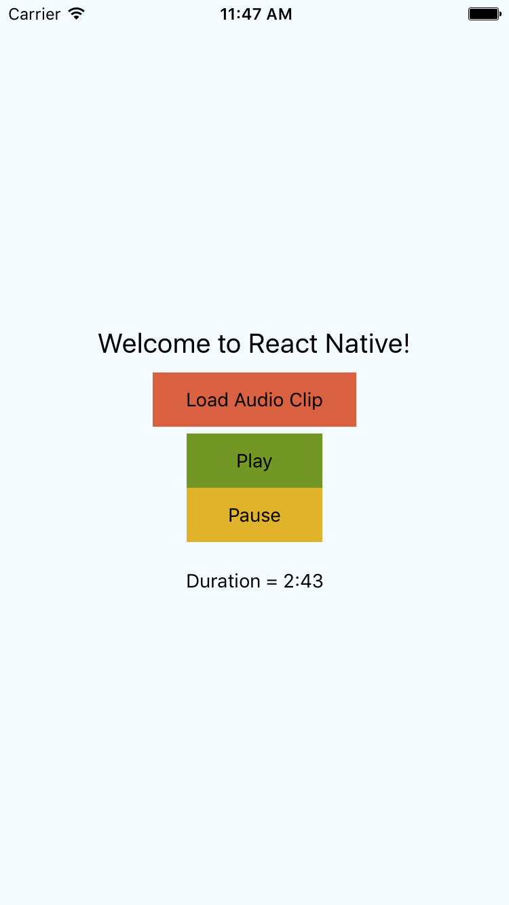
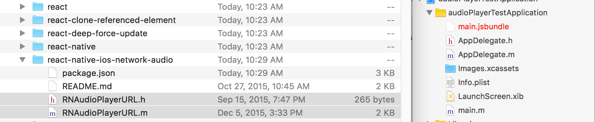
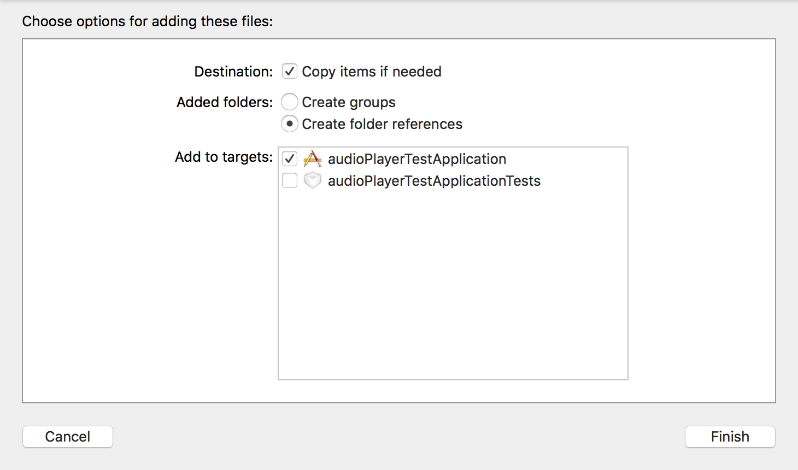
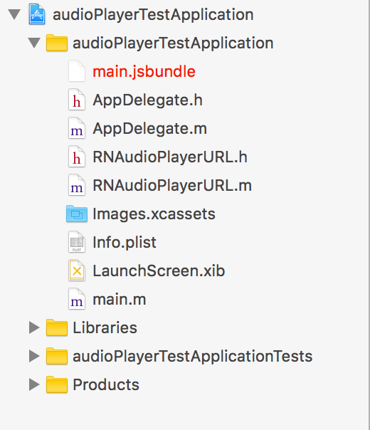
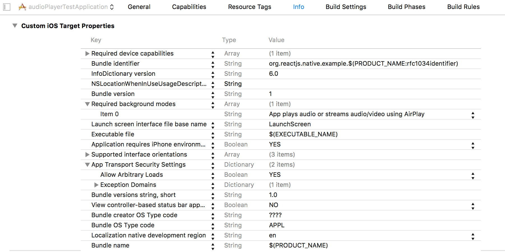
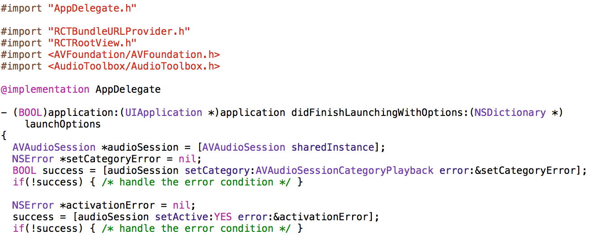

# Test application for react-native-ios-network-audio

###Screenshot of test application
 

##Steps I took to install Successfully:

###Step1:
<li style="font-size:1.3em">Ran '<a href="https://www.npmjs.com/package/react-native-ios-network-audio">npm install react-native-ios-network-audio --save</a>'</li>
 

###Step2:
<li style="font-size:1.3em">Find the node_modules folder and open the project directore in Xcode</li>
 

  
<li style="font-size:1.3em">Drag the '.h' and '.m' files into Xcode in the same directory as AppDelegate.m/.h</li>
<li style="font-size:1.3em">Select copy items if needed and click "finish"</li>
 

 
<li style="font-size:1.3em">Your directory should look like this when you finish</li>
 

 

###Step3:
<li style="font-size:1.3em">Modified the Info section of my project</li>
<li style="font-size:1.3em">Added "Required Background Modes" section with 1 item: "App plays audio or streams ..."</li>
<li style="font-size:1.3em">Added item to "App Transport Security Settings" to "Allow Arbitrary Loads" (This is required for audio url's that are not secure [http vs. https])</li>
 

 

##Things to Note:
<ul>
<li style="font-size:1.3em">This test application was written in es6 format as react-native has shifted towards this, but the original documentation for this package is written in pure jsx syntax</li>
<li style="font-size:1.3em">In order to run the test application you may not need to follow any of these steps</li>
</ul>
 
<li style="font-size:1.3em">For using an audio session to allow for audio to play in the background, refer to my code additions in AppDelegate.m</li>
 

